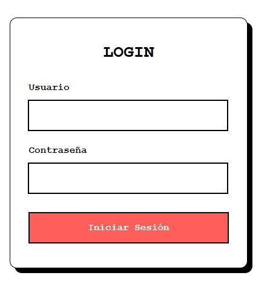
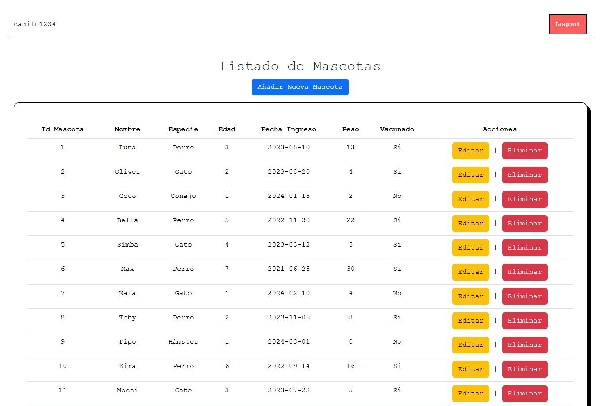
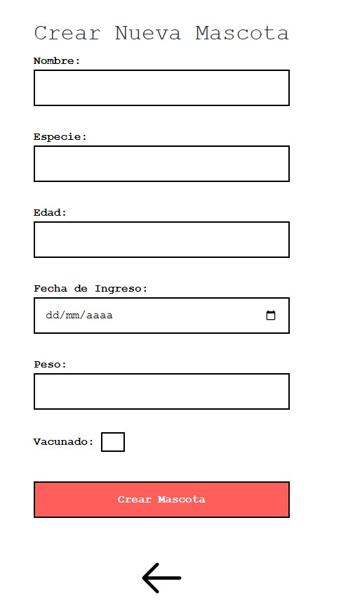
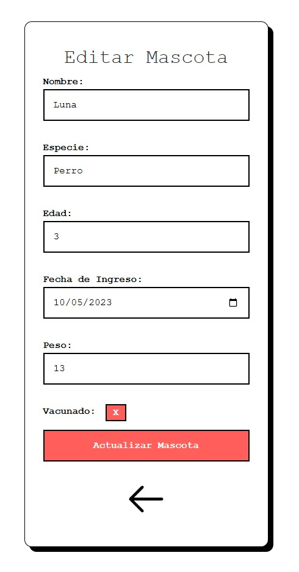

# 🐾 Sistema de Gestión Veterinaria

Proyecto desarrollado en PHP utilizando el patrón de arquitectura **MVC** (Modelo-Vista-Controlador). La aplicación permite gestionar los registros de mascotas de una clínica de forma segura mediante un sistema de autenticación.

## ✨ Características
* **Login de usuarios:** Acceso restringido para proteger la información.
* **CRUD completo:** Funciones para añadir, ver, editar y eliminar mascotas.
* **Arquitectura limpia:** Separación de lógica, datos y vistas.

## 📸 Capturas del Proyecto
Aquí puedes ver el funcionamiento de la interfaz:

**Login:**

**Panel Principal:**

**Creación de Mascotas:**

**Edición de Mascotas:**

## 🛠️ Tecnologías utilizadas
* **PHP**
* **MySQL** (Base de datos)
* **Arquitectura MVC**
* **CSS / Bootstrap**
* * **JS**

## 📂 Estructura del Proyecto
crud-php
  ├── assets/             # Estilos, JS e Imágenes
  ├── config/             # Conexión a la base de datos
  ├── controllers/        # Lógica de las peticiones
  ├── Info Pruebas/       # Documentación y archivos SQL
  │   ├── base_de_datos.sql
  │   └── info_usuarios.txt
  ├── models/             # Consultas y modelos de datos
  ├── views/              # Interfaz de usuario
  └── index.php           # Punto de entrada

  Desarrollado por Camilo Dubra Corchs.
